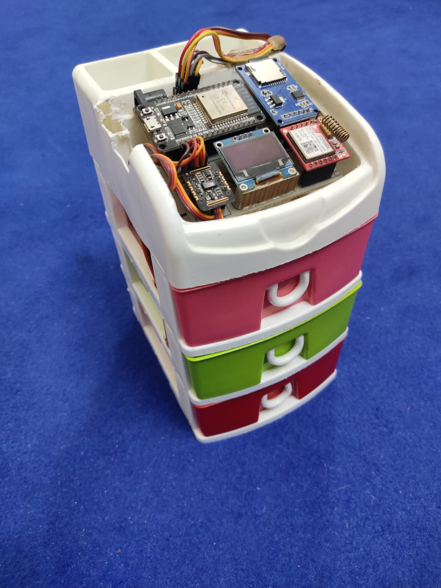
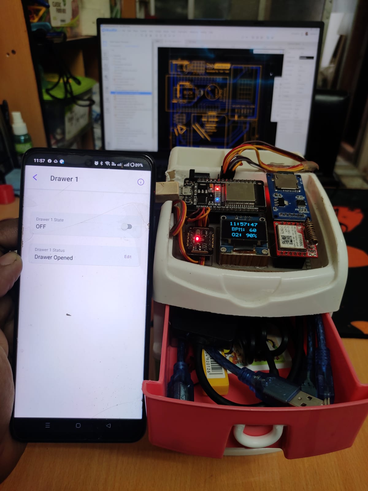
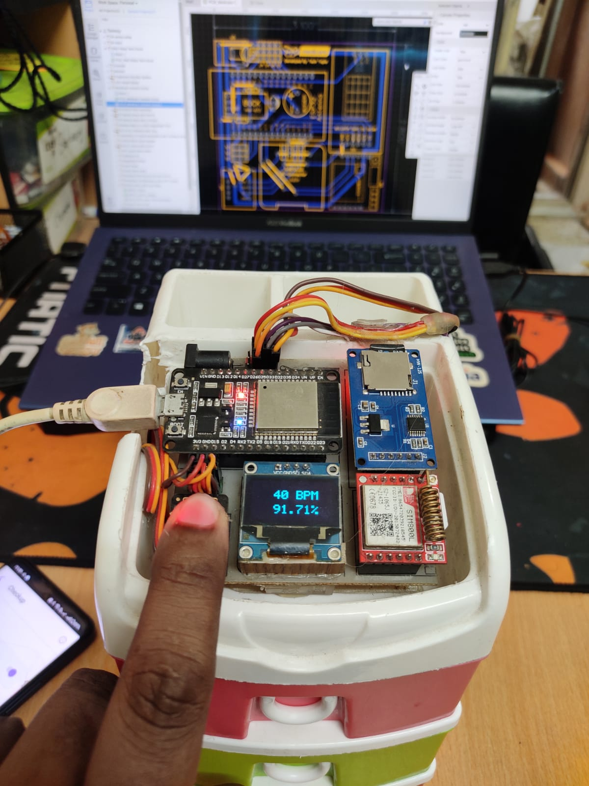
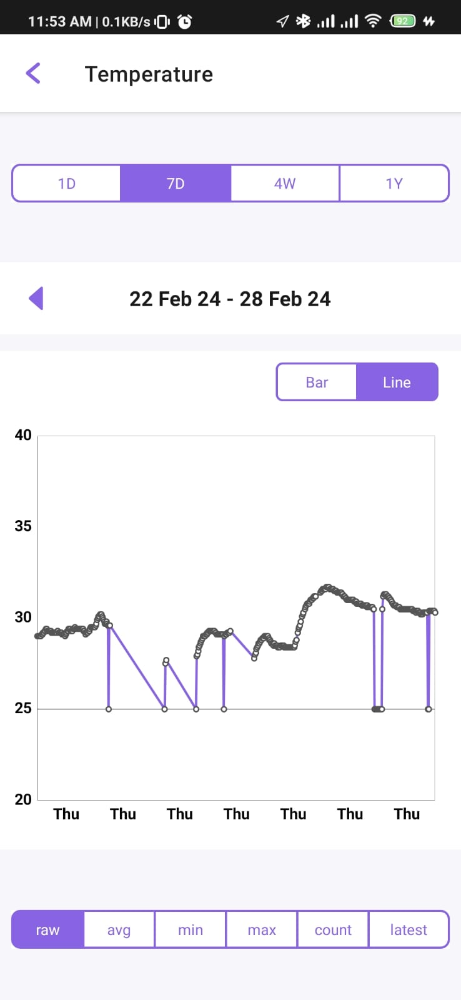
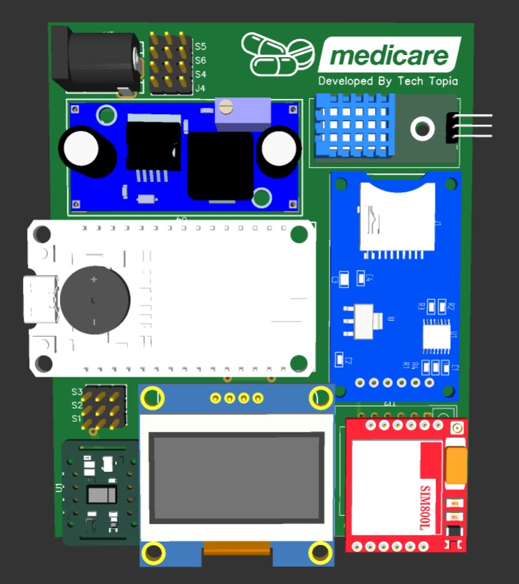
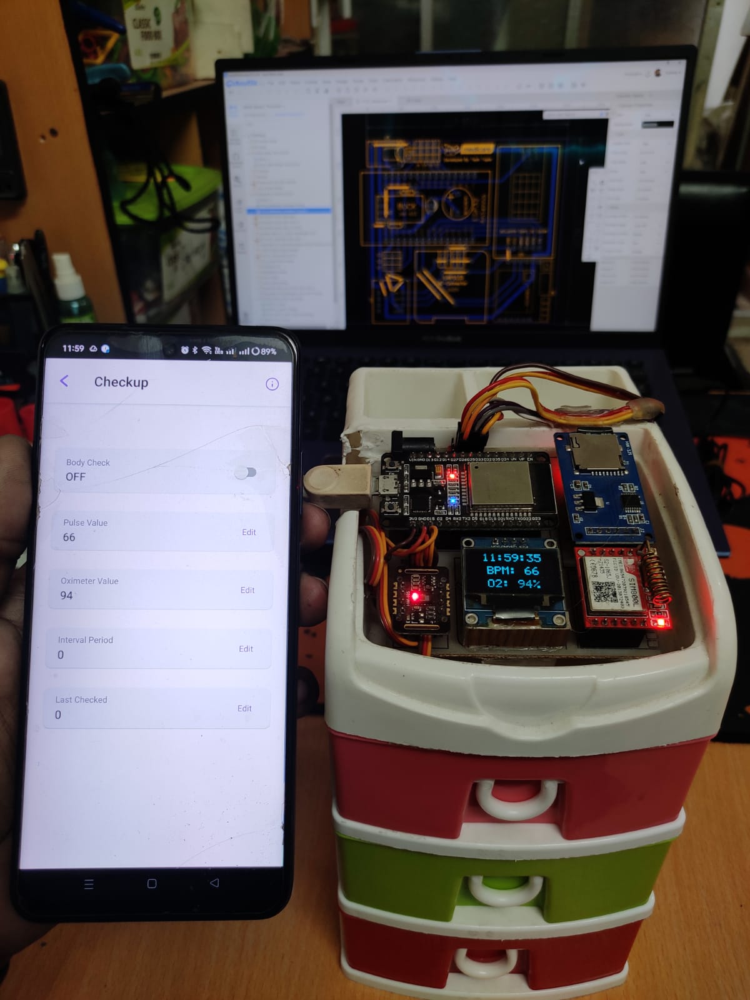
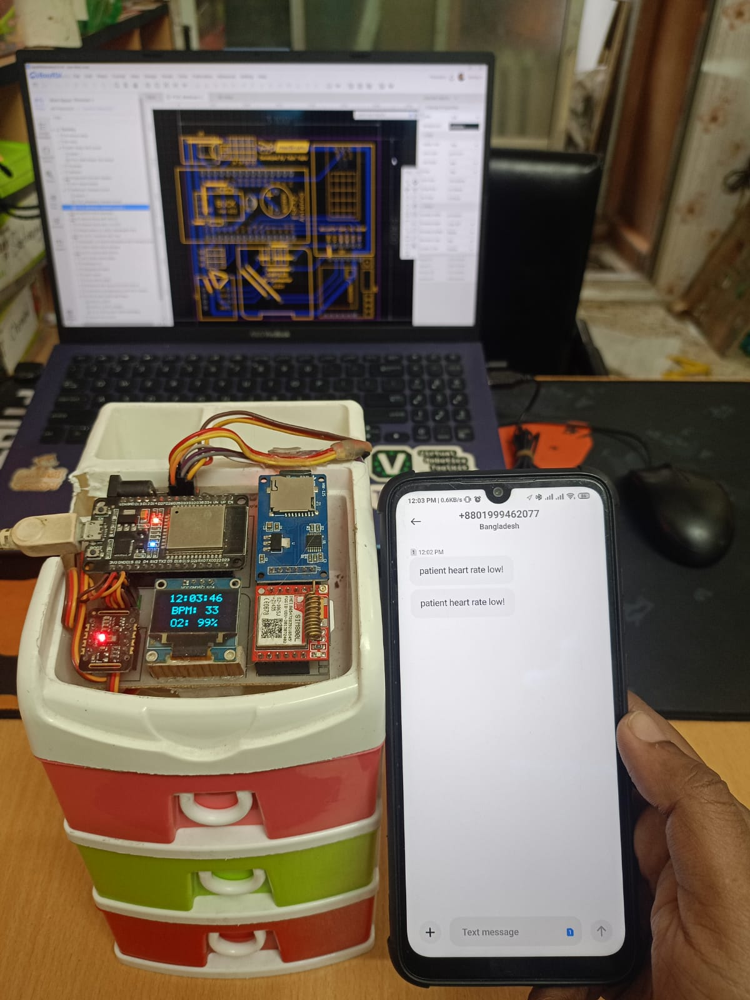

# Medicare – Smart Medicine Reminder & Patient Health Monitoring System



Medicare is an ESP32-based smart healthcare assistant designed to help elderly patients maintain medication schedules and monitor vital health parameters while keeping caregivers informed through cloud notifications, SMS alerts, and emergency phone calls.

The system combines automated medicine reminders, drawer access verification, heart rate and blood oxygen monitoring, cloud connectivity through ESP RainMaker, GSM communication, and local OLED-based interaction into a single healthcare platform.

Unlike traditional reminder devices, Medicare actively verifies patient response and can escalate alerts if medication is missed or health readings become critical.

---

# 🚀 Project Overview

Medication non-compliance and delayed medical response are major concerns for elderly individuals living alone.

Medicare addresses this problem by providing:

* Automated medicine reminders
* Smart medicine drawer management
* Health monitoring
* SMS notifications
* Emergency phone call alerts
* Cloud-based monitoring
* Remote caregiver updates

The system continuously monitors both medication adherence and patient responsiveness, allowing family members and caregivers to intervene when necessary.

---

# ✨ Features

## 💊 Smart Medicine Reminder System

The device contains:

* 3 independent medicine drawers
* Servo-controlled locking system
* Scheduled medicine reminders
* Drawer access verification

Each drawer can be assigned to a different medication schedule.

---

## 🔒 Intelligent Drawer Verification

Unlike simple reminder systems, Medicare verifies whether the patient actually opened the medicine drawer.



The drawer contains a sensor that continuously monitors:

```text
Drawer Closed
Drawer Opened
Drawer Accessed
```

If the drawer remains unopened after a reminder:

```text
Reminder Triggered
      ↓
Wait 1 Minute
      ↓
Drawer Not Opened
      ↓
SMS Alert
      ↓
RainMaker Notification
```

Caregivers immediately receive a notification indicating that medication was not taken.

---

## ❤️ Heart Rate Monitoring

The system includes a MAX30102/MAX30105 sensor for heart rate monitoring.

Features:

* Scheduled heart rate checks
* Manual health checks
* Real-time BPM monitoring
* Cloud reporting

The OLED interface guides the patient through the measurement process.

---

## 🩸 Blood Oxygen Monitoring

Blood oxygen saturation (SpO₂) measurements can be performed automatically according to predefined schedules.

Supported modes:

* Hourly Monitoring
* Daily Monitoring
* Weekly Monitoring
* Manual Checkups

---

## 👆 Patient Response Verification

When a scheduled health check begins:



The device:

* Activates alarm
* Requests finger placement
* Waits for sensor interaction

Workflow:

```text
Scheduled Checkup
        ↓
Alarm Starts
        ↓
Place Finger
        ↓
Measurement
```

If no finger is detected:

```text
Scheduled Checkup
        ↓
No Response
        ↓
SMS Alert
        ↓
RainMaker Alert
```

This ensures the patient is actually responding to monitoring requests.

---

## 🚨 Emergency Health Alerts

If health readings fall below safe thresholds:

* SMS notification is sent
* Mobile application notification is generated
* Automatic phone call can be initiated

Examples include:

* Low Heart Rate
* Low Oxygen Saturation
* Patient Unresponsive

---

## 📞 Automatic Emergency Calling

The system supports GSM-based emergency calling.

When enabled:

```text
Critical Health Event
        ↓
SMS Sent
        ↓
Phone Call Initiated
```

This provides immediate escalation beyond cloud notifications.

---

## 📱 ESP RainMaker Integration

The system integrates with ESP RainMaker to provide:

* Remote monitoring
* Notification delivery
* Medicine scheduling
* Health status monitoring
* Drawer control
* Configuration management

---

## 🌡 Temperature Monitoring

Environmental temperature can also be monitored and reported to the cloud.



This allows caregivers to monitor room conditions remotely.

---

# 🛠 Hardware Used

| Component                | Purpose                          |
| ------------------------ | -------------------------------- |
| ESP32                    | Main Controller                  |
| OLED Display             | User Interface                   |
| MAX30105 Sensor          | Heart Rate & SpO₂ Monitoring     |
| SIM800/SIM900 GSM Module | SMS & Calling                    |
| 3x Servo Motors          | Drawer Lock Control              |
| Drawer Sensors           | Access Verification              |
| DHT11 Sensor             | Temperature Monitoring           |
| Buzzer                   | Alarm & Reminder                 |
| Push Button              | Navigation & Manual Access       |
| EEPROM                   | Persistent Configuration Storage |
| ESP RainMaker            | Cloud Platform                   |

---

# 🔌 PCB Design



The custom PCB integrates:

* ESP32 Controller
* Sensor Interfaces
* GSM Communication
* Servo Control
* OLED Display
* Power Management

This design allows the system to operate as a standalone healthcare device.

---

# 📱 Cloud Dashboard

The ESP RainMaker dashboard provides caregivers with real-time system status.



Available information includes:

* Drawer Status
* Checkup Status
* Heart Rate
* Oxygen Level
* Temperature
* Notification History

---

# ⚙ How It Works

## Step 1 — Medicine Reminder

At scheduled medication time:

```text
Alarm Activated
```

The assigned drawer unlocks automatically.

---

## Step 2 — Drawer Verification

The system checks whether the patient actually opened the drawer.

If opened:

```text
Medication Confirmed
```

If not opened:

```text
Medication Missed
```

and alerts are generated.

---

## Step 3 — Scheduled Health Check

At scheduled health monitoring time:

```text
Please Place Finger
```

is displayed on the OLED screen.

---

## Step 4 — Health Measurement

The system measures:

* Heart Rate
* Blood Oxygen Level

and uploads results to ESP RainMaker.

---

## Step 5 — Health Evaluation

Values are compared against predefined thresholds.

Normal:

```text
Measurement Stored
```

Abnormal:

```text
SMS Alert
Phone Call
App Notification
```

---

# 📡 Notification System

The system supports three notification layers.

## Level 1 — Local Alert

* OLED Message
* Buzzer Alarm

---

## Level 2 — Cloud Alert

* ESP RainMaker Notification

---

## Level 3 — Emergency Communication

* SMS Alert
* Automatic Phone Call

---

# 📲 SMS Alert Examples



Examples:

```text
Patient did not take medicine.

Patient not responding.

Heart Rate Below Safe Limit.

Blood Oxygen Level Critical.
```

---

# 💾 EEPROM Data Storage

The system permanently stores:

* Emergency Phone Number
* Checkup Interval Settings
* User Configuration

Even after power loss.

Phone numbers can be updated directly from the mobile application.

---

# 🎛 Local User Interface

The OLED interface provides:

* Device Setup
* WiFi Provisioning
* Medicine Drawer Control
* Health Monitoring
* System Configuration

Manual drawer access is also available through the onboard push button.

---

# Documentation

Detailed technical documentation is available in the `docs` folder.

## Core Documentation

| Document | Description |
|-----------|-------------|
| [Medication Reminder System](docs/Medication_Reminder_System.md) | Automated medicine scheduling, reminder logic, and compliance tracking |
| [Drawer Verification System](docs/Drawer_Verification_System.md) | Servo-controlled drawer access verification and missed medication detection |
| [Health Monitoring System](docs/Health_Monitoring.md) | Heart rate and blood oxygen monitoring workflow |
| [GSM Notification System](docs/GSM_Notification_System.md) | SMS alerts, emergency calls, and caregiver notifications |
| [EEPROM Storage Map](docs/EEPROM_Storage_Map.md) | Persistent storage architecture and configuration management |
| [User Interface System](docs/User_Interface.md) | OLED-based navigation, setup, and patient interaction |
| [ESP RainMaker Integration](docs/RainMaker_Integration.md) | Cloud connectivity, remote monitoring, and mobile application integration |
| [PCB Design and Hardware Architecture](docs/PCB_Design.md) | Hardware design, PCB architecture, and subsystem integration |

---

## Documentation Flow

New visitors may find the following reading order helpful:

```text
README.md
    ↓
Medication Reminder System
    ↓
Drawer Verification System
    ↓
Health Monitoring System
    ↓
GSM Notification System
    ↓
RainMaker Integration
    ↓
EEPROM Storage
    ↓
User Interface
    ↓
PCB Design
```

---

## Key Subsystems

### Medication Compliance

- Scheduled medicine reminders
- Drawer unlocking
- Access verification
- Missed medication detection

Documentation:

```text
docs/Medication_Reminder_System.md
docs/Drawer_Verification_System.md
```

---

### Patient Health Monitoring

- Heart rate monitoring
- SpO₂ monitoring
- Scheduled checkups
- Emergency detection

Documentation:

```text
docs/Health_Monitoring.md
```

---

### Remote Caregiver Notification

- SMS alerts
- Emergency phone calls
- App notifications

Documentation:

```text
docs/GSM_Notification_System.md
docs/RainMaker_Integration.md
```

---

### Device Configuration

- EEPROM storage
- User settings
- Phone number management
- Device setup

Documentation:

```text
docs/EEPROM_Storage_Map.md
docs/User_Interface.md
```

---

### Hardware Design

- PCB architecture
- Power distribution
- Sensor integration
- GSM subsystem

Documentation:

```text
docs/PCB_Design.md
```

---

# 🎯 Applications

* Elderly Care
* Assisted Living
* Remote Patient Monitoring
* Medication Compliance Tracking
* Home Healthcare
* Smart Healthcare Systems
* Telemedicine Support

---

# 📁 Repository Structure

```text
Medicare/
│
├── medicare.ino
├── drawer.ino
├── checkup.ino
├── sms.ino
├── phone_number.ino
├── display.ino
├── callback.ino
│
├── images/
│   ├── project_demo.jpg
│   ├── project_demo (2).jpg
│   ├── medicine_drawer_open_status.jpg
│   ├── patient_finger_placed_for_monitoring.jpg
│   ├── patient_status_checkup_app_demo.jpg
│   ├── patient_hreat_rate_low_alert_sms_demo.jpg
│   ├── temperature_monitoring_graph_status.jpg
│   └── PCB_view.jpg
│
├── docs/
│   ├── RainMaker_Integration.md
│   ├── Medication_Reminder_System.md
│   ├── Drawer_Verification_System.md
│   ├── Health_Monitoring.md
│   ├── GSM_Notification_System.md
│   ├── EEPROM_Storage_Map.md
│   ├── User_Interface.md
│   └── PCB_Design.md
│
└── README.md
```

---

# 🔮 Future Improvements

* Blood Pressure Monitoring
* Fall Detection
* Camera-Based Patient Verification
* Video Calling Support
* Cloud Health Analytics
* Doctor Dashboard
* Caregiver Mobile Application
* AI-Based Health Prediction

---

# 🎓 Educational Value

This project demonstrates:

* ESP32 Development
* ESP RainMaker Integration
* GSM Communication
* Healthcare IoT
* Sensor Fusion
* Embedded UI Design
* EEPROM Storage
* Cloud-Based Monitoring
* Human-Centered Product Design

---

# 👨‍💻 Author

Developed by **Fazle Elahi Tonmoy**

Areas of Interest:

* Healthcare Technology
* Embedded Systems
* IoT Solutions
* Robotics
* Assistive Technologies

---

# 📄 License

MIT License
